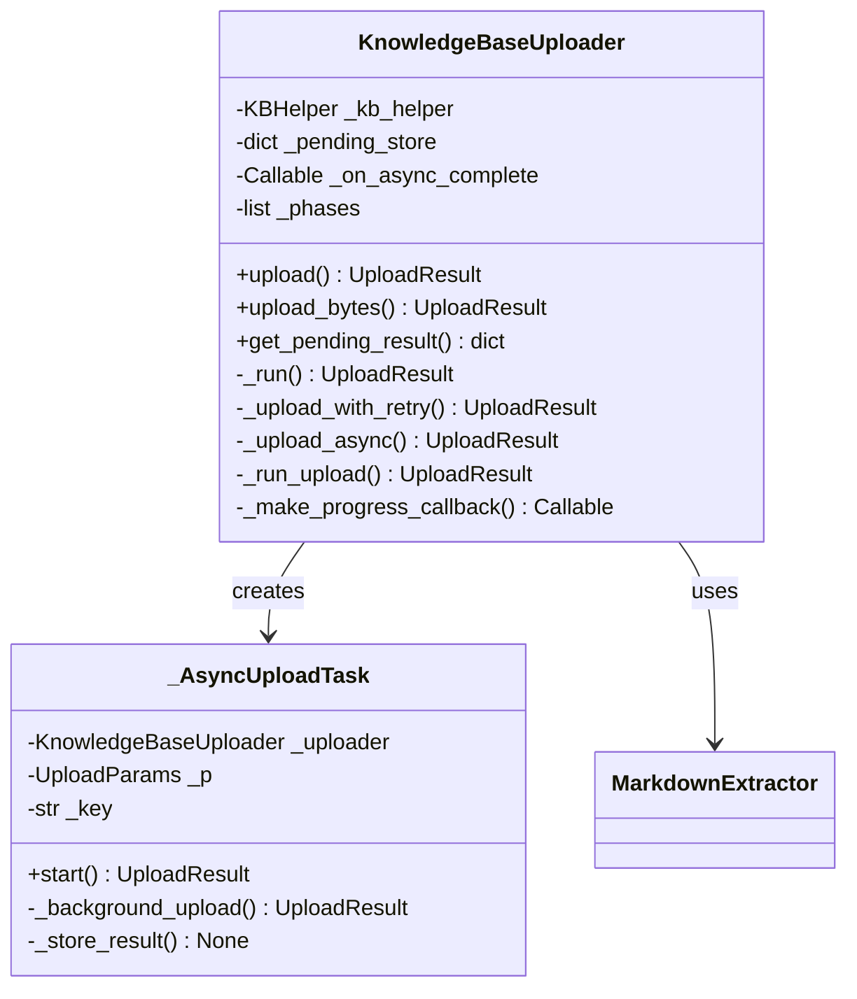
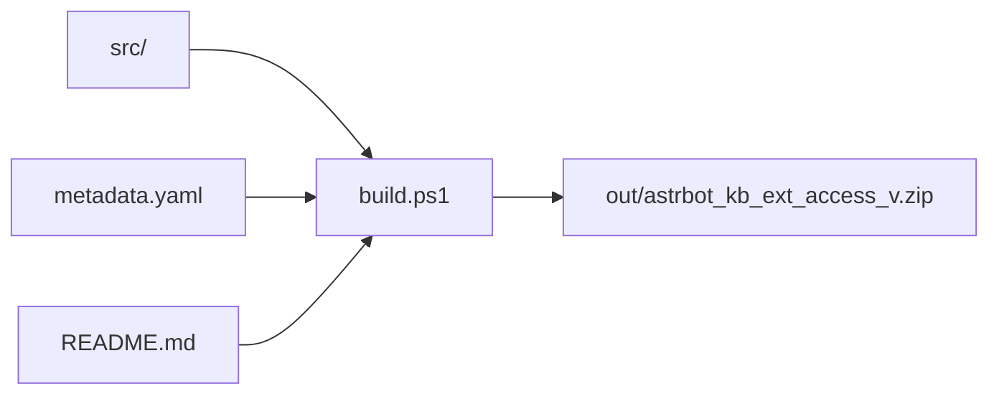
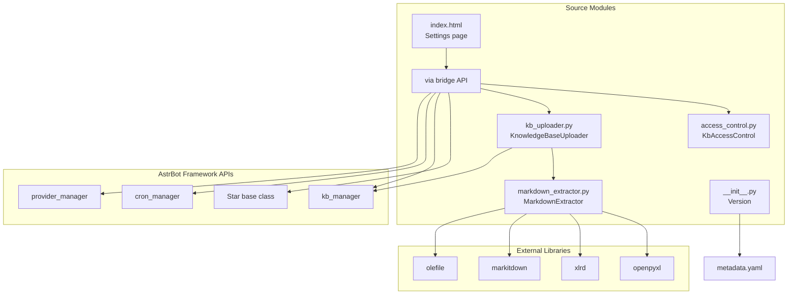

# AstrBot Knowledge Base Extended Access — Architecture Design Document

> Plugin: `astrbot_kb_ext_access` · Version: 1.0.0b
> AstrBot Star plugin providing Agent-facing LLM tools for knowledge base management with configurable access control.

---

## Table of Contents

1. [Overview](#1-overview)
2. [Layered Architecture](#2-layered-architecture)
3. [Module Breakdown](#3-module-breakdown)
4. [Data Flow](#4-data-flow)
5. [LLM Tool Interface Design](#5-llm-tool-interface-design)
6. [Upload Pipeline](#6-upload-pipeline)
7. [Access Control System](#7-access-control-system)
8. [Async & Background Processing](#8-async--background-processing)
9. [Plugin Web UI](#9-plugin-web-ui)
10. [Agent Skill System](#10-agent-skill-system)
11. [Configuration & Build](#11-configuration--build)
12. [Design Decisions & Rationale](#12-design-decisions--rationale)

---

## 1. Overview

### 1.1 Purpose

The **AstrBot Knowledge Base Extended Access** plugin extends AstrBot's knowledge base management capabilities by providing LLM-facing tools (`@llm_tool`) that:

- List, create, delete, and search knowledge bases
- Upload files in three strategies (sync, batch, async)
- Manage documents within knowledge bases
- Enforce configurable whitelist/blacklist access control

All tools call AstrBot's internal Python APIs directly — no HTTP round-trips.

### 1.2 Technology Stack

- **Runtime**: Python 3.11+ (async via `asyncio`)
- **Framework**: AstrBot Star plugin system
- **APIs**: AstrBot `kb_manager`, `cron_manager`, `provider_manager`
- **UI**: Vanilla HTML/CSS/JS with AstrBot bridge SDK
- **Build**: PowerShell (`build.ps1`) → `.zip` archive

---

## 2. Layered Architecture

```
┌────────────────────────────────────────────────────────────┐
│                    LLM Agent (外置)                         │
│  Reads SKILL.md files → calls @llm_tool methods             │
└───────────────────────┬────────────────────────────────────┘
                        │
┌───────────────────────▼────────────────────────────────────┐
│  Layer 1: Tool Interface (main.py)                          │
│  ┌──────────────────────────────────────────────────────┐   │
│  │  @llm_tool methods           Plugin Page Web APIs     │   │
│  │  astr_kb_list                /access-control/kb-list  │   │
│  │  astr_kb_upload              /access-control/config   │   │
│  │  astr_kb_create              /access-control/save     │   │
│  │  astr_kb_delete              /access-control/...      │   │
│  │  ... (12 tools total)                                 │   │
│  └──────────────────────────────────────────────────────┘   │
│  Cross-cutting: tool_error_handler decorator                │
└───────────────────────┬────────────────────────────────────┘
                        │
┌───────────────────────▼────────────────────────────────────┐
│  Layer 2: Business Logic                                    │
│                                                              │
│  ┌──────────────────────┐  ┌────────────────────────────┐   │
│  │  KnowledgeBaseUploader│  │  KbAccessControl            │   │
│  │  • upload()           │  │  • check_kb_access()       │   │
│  │  • upload_bytes()     │  │  • filter_kb_list()        │   │
│  │  • _run_upload()      │  │  • resolve_names()         │   │
│  │  • _upload_async()    │  │  • validate_config()       │   │
│  │  • _upload_with_retry│  │  • add_to_whitelist()      │   │
│  └──────────────────────┘  └────────────────────────────┘   │
│                                                              │
│  ┌────────────────────────────────────────────────────┐     │
│  │  MarkdownExtractor (static)                         │     │
│  │  • extract(raw_bytes, file_name) → str | None      │     │
│  │  • dispatches to _xlsx_to_markdown, _xls_to_markdown,    │
│  │    _doc_to_markdown based on extension                    │
│  └────────────────────────────────────────────────────┘     │
│                                                              │
│  ┌────────────────────────────────────────────────────┐     │
│  │  _AsyncUploadTask (background task encapsulation)   │     │
│  │  • start() → shield + short-wait + store_result    │     │
│  └────────────────────────────────────────────────────┘     │
└───────────────────────┬────────────────────────────────────┘
                        │
┌───────────────────────▼────────────────────────────────────┐
│  Layer 3: AstrBot Framework APIs                            │
│                                                              │
│  • kb_manager.list_kbs()     • kb_manager.get_kb()          │
│  • kb_manager.create_kb()    • kb_manager.delete_kb()       │
│  • kb_manager.retrieve()     • kb_helper.upload_document()  │
│  • kb_helper.list_documents()• kb_helper.get_document()     │
│  • kb_helper.delete_document()                              │
│  • cron_manager.add_active_job() / list_cron_jobs()         │
│  • provider_manager.get_all_embedding_providers()           │
└────────────────────────────────────────────────────────────┘
```

---

## 3. Module Breakdown

### 3.1 `src/main.py` — Tool Orchestrator & Web API

**Responsibility**: Host the `AstrBotKnowledgeBaseExtAccess` Star class, register `@llm_tool` methods and plugin page web APIs.

**Key components**:

| Component | Description |
|-----------|-------------|
| `tool_error_handler` | Decorator that wraps every LLM tool: catches `PermissionError` and `Exception`, returns structured `{"s": bool, "d": ..., "e": str}` JSON |
| `AstrBotKnowledgeBaseExtAccess` | Main Star class; owns `KbAccessControl`, `_async_pending` dict, `_avg_embedding_time` config |
| `initialize()` | Validates access control config, loads persisted config from disk, registers 3 web API routes |
| `_read_sandbox_file()` | Static helper: reads file content from AstrBot sandbox via `event.bot.execute_code` |
| `_match_provider()` | Fuzzy-matches embedding/rerank provider names for KB creation |
| `_persist_config()` / `_load_config_from_file()` | Syncs in-memory access control to `astrbot_kb_ext_access_config.json` |
| `_has_active_upload_lock()` | Queries cron DB for active `upload_check_*` jobs (distributed lock) |

**LLM Tools (12)**:

| Tool | Name | Purpose |
|------|------|---------|
| `list_knowledge_bases` | `astr_kb_list` | List KBs, filtered by access control |
| `upload_to_knowledge_base` | `astr_kb_upload` | Single file upload (sync/async) |
| `upload_to_knowledge_base_batch` | `astr_kb_upload_batch` | Sequential batch upload |
| `check_upload_status` | `astr_kb_check_upload` | Poll async upload progress |
| `schedule_upload_check` | `astr_kb_schedule_check` | Set up recurring cron check |
| `estimate_upload_time` | `astr_kb_estimate_upload_time` | Estimate vectorization time |
| `create_knowledge_base` | `astr_kb_create` | Create KB with provider selection |
| `delete_knowledge_base` | `astr_kb_delete` | Delete KB (requires confirm) |
| `delete_document` | `astr_kb_delete_document` | Delete document (requires confirm) |
| `search_knowledge_base` | `astr_kb_search_ext` | Access-controlled search |
| `list_documents_in_kb` | `astr_kb_list_documents` | List documents in a KB |
| `get_document_content_chunk` | `astr_kb_get_document_content_chunk` | Read one text chunk |

### 3.2 `src/kb_uploader.py` — Upload Pipeline

**Responsibility**: All upload logic — retry, async background, progress tracking. Internal methods return `UploadResult` dataclasses.

**Key types**:

```python
@dataclass
class UploadParams:
    file_name: str
    raw_bytes: bytes
    chunk_size: int = 512
    chunk_overlap: int = 50
    timeout: float = 100.0
    max_retries: int = 3
    wait_completion: bool = True
    upload_task_id: str | None = None

@dataclass
class UploadResult:
    success: bool = False
    pending: bool = False
    doc_id: str | None = None
    chunk_count: int | None = None
    error: str | None = None
    upload_task_id: str | None = None
    kb_helper: Any | None = None
```

**Key components**:

| Component | Description |
|-----------|-------------|
| `KnowledgeBaseUploader` | Main uploader class; holds `KBHelper`, `pending_store` dict, optional completion callback |
| `upload()` / `upload_bytes()` | Public entry points — text/base64 or raw bytes |
| `_run()` | Dispatches to markdown extraction, then sync or async path |
| `_upload_with_retry()` | Sync path: retry loop with timeout, handles `CancelledError` (framework 120s limit) |
| `_upload_async()` | Async path: delegates to `_AsyncUploadTask` |
| `_run_upload()` | Single attempt: writes temp file → calls `kb_helper.upload_document()` with progress callback |
| `_make_progress_callback()` | Returns async callback that mutates `_phases` (safe, single coroutine) |

### 3.3 `src/markdown_extractor.py` — Format Preprocessing

**Responsibility**: Extract clean Markdown from binary file formats that produce poor text via AstrBot's default pipeline (notably Excel files where `pandas.to_html()` converts empty cells to "NaN").

**Design**: Pure static methods, no state. The `extract()` method dispatches by file extension.

| Method | Format | Library | Strategy |
|--------|--------|---------|----------|
| `_xlsx_to_markdown()` | `.xlsx` | `openpyxl` | Iterate worksheets → build Markdown tables with `_build_markdown_table()` |
| `_xls_to_markdown()` | `.xls` | `xlrd` | Same Markdown table builder |
| `_doc_to_markdown()` | `.doc` | `markitdown` → `olefile` fallback | Try MarkItDown first, fall back to raw OLE text extraction |

**Why not plug into AstrBot's pipeline**: The extractor runs at upload time within the plugin, transforming bytes to Markdown before passing to `kb_helper.upload_document()`. This is transparent to both the agent and AstrBot's vectorization.

### 3.4 `src/access_control.py` — Access Control

**Responsibility**: Whitelist/blacklist mechanism for knowledge base access.

**Decision logic** (priority order):

```
1. kb_id in blacklist → DENY
2. whitelist mode AND kb_id not in whitelist → DENY
3. Otherwise → ALLOW
```

**Key features**:

| Feature | Description |
|---------|-------------|
| `resolve_names()` | Backward compatibility: resolves KB names in old config to IDs via live KB list |
| `validate_config()` | Ensures mode is `whitelist` or `blacklist` |
| `check_kb_access()` | Raises `PermissionError` if access denied |
| `filter_kb_list()` | Filters a KB list according to current rules |
| `auto_whitelist_created` | When `True`, newly created KBs auto-added to whitelist |
| `add_to_whitelist()` | Idempotent add (only effective in whitelist mode) |

### 3.5 `src/__init__.py` — Package Init

Minimal: dynamically reads `__version__` from `metadata.yaml`. No re-export of symbols.

### 3.6 `src/pages/access-control/index.html` — Plugin Settings Page

Self-contained HTML page using AstrBot's `bridge-sdk.js` for API calls. Features:

- Dual-section UI: whitelist and blacklist
- Searchable KB picker dialog
- Real-time save via `POST /access-control/save`
- Visual badges for KB status

### 3.7 `src/.astrbot-plugin/i18n/` — Internationalization

Contains i18n resources for the plugin.

---

## 4. Data Flow

### 4.1 Upload Flow (Sync)

```
Agent calls astr_kb_upload(kb_id, file_name, sandbox_path, wait_completion=true)
    │
    ▼
main.py: upload_to_knowledge_base()
    ├── access_control.check_kb_access(kb_id)
    ├── kb_manager.get_kb(kb_id) → kb_helper
    ├── _read_sandbox_file(event, sandbox_path) → raw_bytes
    ├── KnowledgeBaseUploader(kb_helper, ...)
    │   └── upload_bytes(file_name, raw_bytes, ...)
    │       └── _run(params)
    │           ├── MarkdownExtractor.extract(raw_bytes, file_name)
    │           │   └── dispatches to _xlsx_to_markdown() / _xls_to_markdown() / _doc_to_markdown()
    │           └── _upload_with_retry(params)
    │               └── retry loop (max_retries times):
    │                   └── _run_upload(params, start_time)
    │                       ├── write temp file
    │                       ├── kb_helper.upload_document(...) with progress callback
    │                       └── return UploadResult(doc_id, chunk_count)
    └── Serialize UploadResult → {"s": true, "d": {"pending": false, ...}, "e": null}
```

### 4.2 Upload Flow (Async)

```
Agent calls astr_kb_upload(..., wait_completion=false)
    │
    ▼
main.py: upload_to_knowledge_base()
    ├── Check _has_active_upload_lock() → reject if exists
    ├── Generate upload_task_id (UUID)
    ├── Store pending entry in _async_pending
    ├── KnowledgeBaseUploader → _run() → _upload_async()
    │   └── _AsyncUploadTask.start()
    │       ├── asyncio.create_task(_background_upload())
    │       ├── asyncio.wait_for(asyncio.shield(task), timeout=short_wait)
    │       ├── If timeout → asyncio.create_task(_store_result(task))
    │       └── Return UploadResult(pending=true, upload_task_id)
    └── Return {"s": true, "d": {"pending": true, "upload_task_id": "uuid-xxx"}, "e": null}

    ── Later: Agent calls astr_kb_schedule_check(upload_task_id, interval_seconds) ──
    │
    ▼
main.py: schedule_upload_check()
    ├── cron_manager.add_active_job(name="upload_check_<id>", recurring)
    └── cron fires every N seconds → agent checks astr_kb_check_upload()

    ── Cron fires: Agent calls astr_kb_check_upload(upload_task_id) ──
    │
    ▼
main.py: check_upload_status()
    ├── Lookup upload_task_id in _async_pending
    │   ├── {"stage": ...} → processing
    │   ├── {"success": true, "result": UploadResult} → completed
    │   └── {"success": false, ...} → failed
    └── Return status JSON
```

### 4.3 Search Flow

```
Agent calls astr_kb_search_ext(query)
    │
    ▼
main.py: search_knowledge_base()
    ├── kb_manager.list_kbs() → all_kbs
    ├── access_control.filter_kb_list(all_kbs) → allowed_kbs
    ├── kb_manager.retrieve(query, kb_names=allowed_kb_names, top_k_fusion=20, top_m_final=5)
    └── Return {"s": true, "d": {"results": context_text, "kb_count": N}, "e": null}
```

---

## 5. LLM Tool Interface Design

### 5.1 Return Schema Convention

Every `@llm_tool` method returns a JSON string following a discriminated union pattern:

```typescript
type ToolResult<D> =
  | { s: true,  d: D,          e: null  }  // success
  | { s: true,  d: null,       e: null  }  // success, no data
  | { s: false, d: null,       e: string}  // error
```

Some tools extend this pattern:
- **Batch upload**: `d` contains `{ total, success, fail, results: [...] }`
- **Delete operations**: Intermediate `d` with `{ confirm_required: true }` for safety
- **Document content**: Uses `c` instead of `d` for the text chunk (self-documenting key)
- **Schedule check**: Returns `{ job_id, upload_task_id, interval_seconds }`

### 5.2 Parameter Design Principles

- Parameters ≤ 3 per tool; complex upload uses `UploadParams` dataclass internally
- `file_name` is mandatory (drives markdown extraction dispatch)
- `sandbox_path` and `file_content` are mutually exclusive data sources
- `confirm` parameter on destructive operations follows a two-step protocol
- Fuzzy matching for provider names reduces agent guesswork

### 5.3 Error Handling Strategy

```
┌─────────────────────────────────────────────┐
│  LLM Tool Call                               │
│  ┌───────────────────────────────────────┐   │
│  │  @tool_error_handler                   │   │
│  │  ├── try: return await func(*args)     │   │
│  │  ├── except PermissionError → {"s": F} │   │
│  │  └── except Exception → {"s": F}       │   │
│  └───────────────────────────────────────┘   │
│                                              │
│  Internal logic: exceptions propagate up     │
│  • KbAccessControl.check_kb_access → PE      │
│  • KB API calls → various exceptions         │
│  • Invalid config → ValueError               │
│                                              │
│  Tools with custom error handling:            │
│  • upload_to_knowledge_base_batch            │
│    (per-item try/except for partial success) │
└─────────────────────────────────────────────┘
```

---

## 6. Upload Pipeline

### 6.1 Three Upload Strategies

| Strategy | Tool | Condition | Behavior |
|----------|------|-----------|----------|
| **A — Sync** | `astr_kb_upload` (wait=true) | Estimated < 100s | Blocks until vectorization complete |
| **B — Batch** | `astr_kb_upload_batch` | All < 30s each | Sequential blocking uploads |
| **C — Async** | `astr_kb_upload` (wait=false) + `schedule_check` | > 100s | Background + recurring cron polling |

### 6.2 Time Estimation Algorithm

```
Input: file_size_bytes, file_name, chunk_size, chunk_overlap

1. Determine text_ratio by extension:
   .txt/.md → 1.0, .pdf → 0.4, .docx → 0.25, .xlsx → 0.1, etc.

2. estimated_chars = file_size_bytes × text_ratio
3. effective_chunk_size = max(chunk_size - chunk_overlap, 1)
4. estimated_chunks = max(1, estimated_chars / effective_chunk_size)
5. estimated_seconds = estimated_chunks × avg_embedding_time (configurable, default 1.5s)

6. Strategy selection:
   estimated_seconds ≤ 30  → "sync_fast"
   estimated_seconds ≤ 100 → "sync"
   > 100                   → "async"
```

### 6.3 Retry Mechanism

- Configurable `max_retries` (default 3) and `timeout` (default 100s)
- On `asyncio.TimeoutError`: retry with descriptive message ("上传超时")
- On `asyncio.CancelledError`: distinct message ("上传被取消 — AstrBot 框架 120s 工具调用超时限制")
- On general `Exception`: retry with error message
- 1-second delay between retries

### 6.4 Background Upload Safety

- **Lock mechanism**: `_has_active_upload_lock()` queries cron DB for existing `upload_check_*` jobs
- **Shield protection**: `asyncio.shield()` prevents cancellation by framework timeout
- **Short initial wait**: `min(timeout, 30)` seconds initial wait before returning pending status
- **Result storage**: Background task stores `UploadResult` in shared `_pending_store` dict (keyed by `upload_task_id`)
- **Completion callback**: `_on_async_complete` called after result stored (used for lock management)

---

## 7. Access Control System

### 7.1 Architecture

```
┌──────────────────────────────────┐
│  KbAccessControl                  │
│                                  │
│  mode: "whitelist" | "blacklist" │
│  whitelist: set[str] (kb_ids)    │
│  blacklist: set[str] (kb_ids)    │
│  _raw_whitelist: set[str]        │
│  _raw_blacklist: set[str]        │
│  _resolved: bool                 │
│  _auto_whitelist: bool           │
│                                  │
│  Methods:                         │
│  • check_kb_access(kb_id)        │
│  • filter_kb_list(kbs)           │
│  • resolve_names(kbs)            │
│  • validate_config()             │
│  • add_to_whitelist(kb_id)       │
└──────────────────────────────────┘
```

### 7.2 Persistence

```
Config Flow:
  Plugin init → _load_config_from_file()
      ↓ reads
  astrbot_kb_ext_access_config.json (in AstrBot config dir)
      ↑ writes
  Plugin page save → _api_save_config() → _persist_config()
  KB creation → auto-whitelist → _persist_config()
  KB deletion → clean up whitelist/blacklist → _persist_config()
```

### 7.3 Name Resolution (Backward Compatibility)

Older configs stored KB names instead of IDs. `resolve_names()` maps names to IDs via a live KB list. This runs during plugin initialization if not yet resolved.

---

## 8. Async & Background Processing

### 8.1 Class Diagram



### 8.2 Cron-based Polling Flow

```
astr_kb_upload(wait_completion=false)
    ↓ returns upload_task_id
astr_kb_schedule_check(upload_task_id, interval_seconds)
    ↓ creates recurring cron job
┌──────────────────────────────────────────┐
│ Cron fires every N seconds               │
│  → Agent wakes                           │
│  → astr_kb_check_upload(upload_task_id)  │
│  → Check _async_pending store            │
│    ├── processing → do nothing            │
│    └── completed → report + clean up      │
└──────────────────────────────────────────┘
```

Key properties:
- Cron is server-side (uses AstrBot's `cron_manager`), immune to agent time drift
- Minimum interval: 180 seconds (3 minutes)
- Job survives plugin restart (cron DB storage)
- Unique job names (`upload_check_<uuid[:12]>`) prevent duplicates

---

## 9. Plugin Web UI

### 9.1 Architecture

```
src/pages/access-control/
    └── index.html          # Self-contained SPA
        ├── HTML structure  # Whitelist/blacklist sections, picker dialog
        ├── CSS             # Inline styles (no external deps)
        └── JavaScript      # Logic using AstrBot bridge-sdk.js
```

### 9.2 API Endpoints

| Route | Method | Description | Handler |
|-------|--------|-------------|---------|
| `/<plugin>/access-control/kb-list` | GET | List all KBs (name, id, emoji, counts) | `_api_kb_list` |
| `/<plugin>/access-control/config` | GET | Get current access control config | `_api_get_config` |
| `/<plugin>/access-control/save` | POST | Save access control config | `_api_save_config` |

Registration happens in `initialize()` using `self.context.register_web_api()`.

### 9.3 Data Model (Client-side)

```javascript
// All KBs loaded from API
allKbs = [{ kb_id, kb_name, emoji, description, doc_count, chunk_count }]

// Client state
wl = Set<string>     // whitelisted kb_ids
bl = Set<string>     // blacklisted kb_ids
mode = "whitelist"   // current mode
```

---

## 10. Agent Skill System

### 10.1 Skill File Layout

```
src/skills/
├── astrbot-kb-ext-access-skills/     # Tool index & hard rules
├── astr-kb-list/                     # List KBs
├── astr-kb-create/                   # Create KB
├── astr-kb-delete/                   # Delete KB
├── astr-kb-delete-document/          # Delete document
├── astr-kb-list-documents/           # List documents
├── astr-kb-get-document/             # Get document chunk
├── astr-kb-search-ext/               # Access-controlled search
├── astr-kb-estimate-upload-time/     # Time estimation
├── astr-kb-upload-fast/              # Sync & batch upload
├── astr-kb-upload-async/             # Async upload workflow
└── astr-kb-check-upload/             # Check upload status
```

### 10.2 Decision Hierarchy

```
Agent receives user request
    │
    ├── "search KB" → astr-kb-search-ext/SKILL.md
    │   └── Decision: use built-in search or plugin search?
    │
    ├── "upload file" → estimate time first
    │   ├── < 30s → astr-kb-upload-fast (Strategy A or B)
    │   ├── 30-100s → astr-kb-upload-fast (Strategy A)
    │   └── > 100s → astr-kb-upload-async (Strategy C)
    │
    ├── "create KB" → astr-kb-create/SKILL.md
    │
    └── "delete" → astr-kb-delete/ or astr-kb-delete-document/
        └── Always request confirmation first
```

### 10.3 Hard Rules (Enforced via SKILL.md)

1. Before ANY deletion, ask for user confirmation
2. Before ANY upload, call `astr_kb_list` first for `kb_id`
3. NEVER use `sleep` to wait for uploads — use `future_task`/cron
4. NEVER launch multiple concurrent async uploads
5. After async upload, MUST schedule a recurring cron check
6. Always report results with doc_id, chunk_count, success/failure

---

## 11. Configuration & Build

### 11.1 Configuration Schema (`_conf_schema.json`)

| Key | Type | Default | Description |
|-----|------|---------|-------------|
| `avg_embedding_time` | float | 1.5 | Embedding time per chunk (seconds) |
| `kb_access_control.mode` | string | `"whitelist"` | Access control mode |
| `kb_access_control.whitelist` | list[str] | `[]` | Allowed KB IDs |
| `kb_access_control.blacklist` | list[str] | `[]` | Blocked KB IDs |
| `kb_access_control.auto_whitelist_created` | bool | `true` | Auto-add created KBs to whitelist |

### 11.2 Build Pipeline



- Reads version from `src/metadata.yaml`
- Excludes `__pycache__`
- Includes `README.md` from project root
- Output: `out/astrbot_kb_ext_access_<version>.zip`

### 11.3 Metadata (`metadata.yaml`)

```yaml
name: astrbot_kb_ext_access
desc: 为 AstrBot Agent 提供知识库列表查询、文件上传与知识库创建能力...
author: AstrBot
version: 1.0.0b
repo: https://github.com/astrbot/astrbot
pages:
  - name: access-control
    title: 知识库访问控制
    entry_file: index.html
```

---

## 12. Design Decisions & Rationale

### 12.1 Why separate `markdown_extractor.py` from `kb_uploader.py`?

- **Single Responsibility**: Upload logic should not know about format-specific text extraction
- **Extensibility**: Adding `.docx` or `.pptx` support changes only `markdown_extractor.py`
- **Testability**: Pure static methods are trivially testable without upload infrastructure

### 12.2 Why `UploadParams` / `UploadResult` dataclasses?

- **Parameter explosion**: `upload()` originally had 11 parameters
- **Type safety**: Named fields with defaults, no positional confusion
- **Evolution**: Adding a parameter changes one dataclass field, not every call site
- **Documentation**: Dataclass docstrings serve as single-point-of-truth for parameter documentation

### 12.3 Why a shared `tool_error_handler` decorator?

- **DRY**: Every tool previously had identical `try/except PermissionError/Exception` blocks
- **Consistency**: All tools return the same JSON shape on error
- **Separation**: Tool methods focus on business logic, error formatting is cross-cutting

### 12.4 Why cron-based polling instead of callback chains?

- **Reliability**: Server-side cron jobs survive plugin restarts (persisted to DB)
- **Simplicity**: Recurring mode eliminates complex callback chain management
- **Agent-friendly**: Agent just checks status when woken; no need to chain future_tasks
- **Distributed safety**: Cron job existence serves as a distributed lock

### 12.5 Why `asyncio.shield()` for background uploads?

AstrBot's framework imposes a ~120s tool-call timeout. Without `shield()`, an upload nearing completion would be cancelled by the framework, losing the result. `shield()` protects the critical vectorization call while the initial short-wait returns control to the agent.

### 12.6 Why inline HTML/JS for the settings page?

- **Zero dependencies**: No build step, no npm, no framework
- **Self-contained**: Single file deployable within the plugin zip
- **AstrBot integration**: Uses `bridge-sdk.js` for API calls (provided by AstrBot)
- **Sufficient complexity**: A two-list UI with a modal picker doesn't warrant React/Vue

### 12.7 Why `metadata.yaml` as single version source?

- **Single source of truth**: Avoids mismatched versions between `__init__.py`, `build.ps1`, and `metadata.yaml`
- **Dynamic reading**: `__init__.py` parses `metadata.yaml` at runtime; `build.ps1` reads it at build time
- **Convention**: AstrBot ecosystem expects version in `metadata.yaml`

---

## Appendix A: File Map

```
ProjectRoot/
├── build.ps1                           # Build → .zip
├── LICENSE                             # MIT
├── ChangeLog.md                        # Version history
├── README.md                           # Plugin README
├── .github/
│   └── copilot-instructions.md         # Coding guide for AI assistants
├── design/
│   ├── Coding style guideline.md       # Coding conventions
│   └── ARCHITECTURE.md                 # ← This document
├── src/
│   ├── __init__.py                     # __version__ from metadata.yaml
│   ├── main.py                         # Star class, 12 @llm_tool, 3 web APIs
│   ├── access_control.py               # KbAccessControl
│   ├── kb_uploader.py                  # Upload pipeline, retry, async
│   ├── markdown_extractor.py           # Binary→Markdown conversion
│   ├── metadata.yaml                   # Plugin metadata (version source)
│   ├── _conf_schema.json              # Config schema for AstrBot UI
│   ├── .astrbot-plugin/i18n/          # Internationalization
│   ├── pages/access-control/
│   │   └── index.html                  # Plugin settings SPA
│   └── skills/                         # 11 Agent SKILL.md files
│       ├── astrbot-kb-ext-access-skills/
│       ├── astr-kb-list/
│       ├── astr-kb-create/
│       ├── astr-kb-delete/
│       ├── astr-kb-delete-document/
│       ├── astr-kb-list-documents/
│       ├── astr-kb-get-document/
│       ├── astr-kb-search-ext/
│       ├── astr-kb-estimate-upload-time/
│       ├── astr-kb-upload-fast/
│       ├── astr-kb-upload-async/
│       └── astr-kb-check-upload/
└── out/                                # Build output (.zip archives)
```

## Appendix B: Dependency Graph



---

*Document generated from codebase analysis. Last updated: 2026-06-13.*
